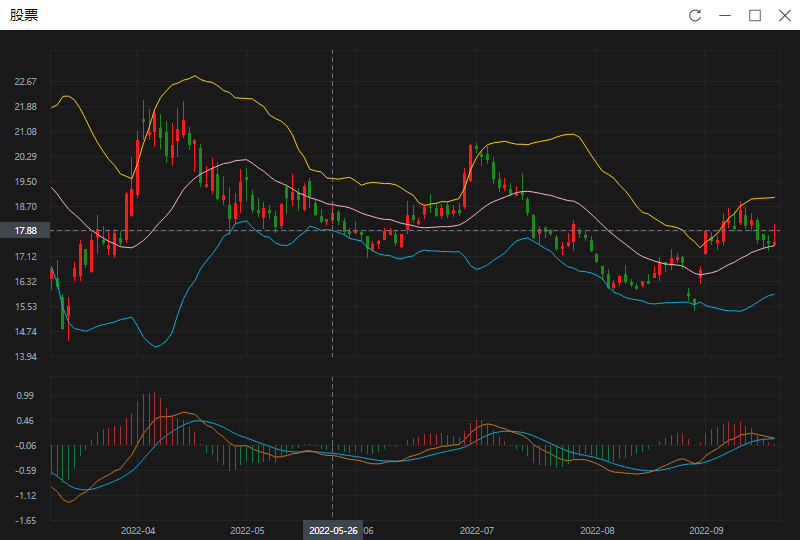

# TradeGraph

​	之前用python做量化交易，需要画k线和各种曲线，使用了mpl_finance，但体验太差，不支持拖拽而且性能很差，于是就自己写了个k线图工具TradeGraph，性能媲美专业的股票软件，运行界面如下图：



### 使用方法

先运行TradeGraph.exe程序，再运行python.exe example.py即可。

 python使用示例如下：

```python
import tg;

#初始化k线
tg.INIT(open=OPEN,high=HIGH,low=LOW,close=CLOSE,vol=VOL,date=DATE,title="股票");

#绘制MA10
tg.PLOT(MA10.tolist(),name="MA10",color=0xfff0861e);

#绘制MACD
tg.PLOT(dea.tolist(),name="DEA",color=0xff0da5da,view="MACD_VIEW");
tg.PLOT(dif.tolist(),name="DIF",color=0xffcc731c,view="MACD_VIEW");
tg.BAR(macd.tolist(),name="MACD",top_color=0xff6f7680,bottom_color=0xff12783c, view="MACD_VIEW");    

```

详细代码可参考example.py，可结合MyTT库做量化策略分析。

### 注意事项

使用python时需要安装pandas库和pyzmq库。

```shell
pip install pandas
pip install pyzmq
```

